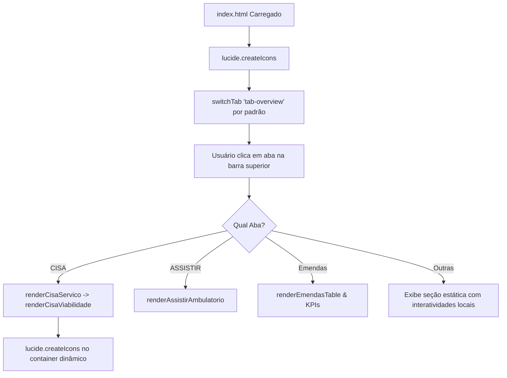

# Arquitetura Técnica & Padrões do Sistema

## 1. Stack Tecnológica & Escolhas Padrão ("A IA Acerta na Primeira Tentativa")

Para assegurar máxima robustez, facilidade de manutenção e eliminar erros de configuração ou build por qualquer Inteligência Artificial ou desenvolvedor que atue no projeto, adota-se a seguinte matriz de tecnologias obrigatórias:

### 1.1 Matriz de Tecnologias

| CAMADA | TECNOLOGIA | POR QUE | STATUS NO PROJETO |
| :--- | :--- | :--- | :--- |
| **Backend** | Python + Flask | Sem configuração. A IA gera correto de primeira. | Servidor estático atual; se houver backend, usar Flask |
| **Banco** | SQLite | Zero instalação. Arquivo único. Fácil de inspecionar. | Banco local embarcado para persistência |
| **Frontend** | HTML + Jinja2 + Bootstrap | Funciona. CDN. Sem build step. | HTML5 + CSS nativo + Vanilla JS (Zero build) |
| **Mapas** | Leaflet.js + OpenStreetMap | Gratuito, sem API key, offline possível. | Padrão obrigatório para recursos geográficos |
| **Grafos** | Cytoscape.js | Feito pra grafo. A IA acerta mais que no D3. | Padrão obrigatório para diagramas de rede |
| **Gráficos** | Chart.js | CDN. Barras, pizza, linha — o suficiente. | **Em uso ativo** (Chart.js v4.4.1 via CDN) |
| **Dados** | Pandas + openpyxl | Importar ERB, CDR, qualquer planilha. | Scripts de extração e tratamento de dados SUS |
| **Áudio** | Whisper (local) | Transcrição offline. Dados ficam na rede interna. | Transcrições de reuniões/áudios sem envio externo |
| **PDF** | pdfplumber + Tesseract | Nativo e escaneado. Detecta automaticamente. | Leitura de contratos SUS, portarias e relatórios |
| **IA local** | Ollama | Privacidade total. Sem internet. | Execução de LLMs locais sem tráfego de dados sensíveis |
| **IA cloud** | Gemini Free / Groq Free | Modelos maiores. Análise de imagem. | Visão computacional e análises pesadas |
| **Segurança** | python-dotenv | Chaves fora do código. Regra mínima. | Arquivo `.env` para credenciais e segredos |

### 1.2 Regras Específicas por Camada

1. **Frontend & Interface**:
   - **Zero Build Step**: O projeto não utiliza Node.js, Webpack, Vite, React ou frameworks com etapa de compilação.
   - **Estilo Atual**: O projeto conta com um Design System próprio em `style.css` (~5.700 linhas) baseado em variáveis CSS customizadas. Qualquer biblioteca CSS externa (como Bootstrap via CDN) só deve ser introduzida em módulos isolados ou templates Jinja2 específicos, **jamais** sobrescrevendo as classes globais (`.card`, `.btn`, `.badge`, `.tab-pane`) para não desconfigurar o layout existente.
   - **Ícones**: Lucide Icons via CDN (`lucide.createIcons()`).
2. **Gráficos & Visualização**:
   - Já em uso: **Chart.js** via CDN (`https://cdn.jsdelivr.net/npm/chart.js@4.4.1/dist/chart.umd.min.js`).
   - Para mapas: estritamente **Leaflet.js** + tiles do **OpenStreetMap** (sem chaves de API pagas).
   - Para redes/fluxos relacionais: estritamente **Cytoscape.js** (não utilizar D3.js).
3. **Backend & Persistência**:
   - Caso seja necessário criar endpoints de API ou persistência em servidor, deve-se criar uma aplicação **Flask** simples (`app.py`) conectada a um banco **SQLite** (`database.db`).
   - Todas as configurações e chaves de API devem ser carregadas via **`python-dotenv`** a partir de um arquivo `.env` (ignorado no Git).
4. **Tratamento de Dados & Documentos**:
   - Para ingestão de planilhas orçamentárias (SIA, SIH, CISA, emendas): **Pandas + openpyxl**.
   - Para leitura de relatórios de faturamento e portarias em PDF: **pdfplumber** (PDFs textuais nativos) combinado com **Tesseract** (PDFs escaneados com OCR).

---

## 2. Padrões de Projeto & Design System

### 2.1 Padrão Visual de Tabelas Financeiras (Padrão CISA)
Definido como padrão oficial do sistema para todas as tabelas orçamentárias:
- **Colunas Padronizadas**:
  1. Identificação / Nome do Item ou Procedimento
  2. **QTD** (Quantidade pactuada ou recursos alocados)
  3. **R$ UNITÁRIO** (Valor unitário de referência ou salário contratado)
  4. **TOTAL/MÊS** (Resultado da multiplicação `Qtd × Unitário`, com destaque visual em azul para receitas e vermelho para custos)
  5. Status / Ações (Indicadores de cotação e botões de ação compactos)
- **Cabeçalhos de Tabela**: Fundo suave, tipografia em caixa alta, tracking legível, bordas sutis.
- **Linhas e Células**: Padding vertical confortável (`8px`), inputs inline formatados e sem poluição visual.

### 2.2 Gerenciamento de Estado (State Management)
O sistema mantém seu estado em memória através de variáveis globais e objetos no escopo `window`:
- `window.cisaSimState`: Estado padrão de referência para a pactuação CISA (procedimentos e custos operacionais fixos).
- `window.activeCisaSim`: Estado ativo mutável da simulação CISA atual.
- `window.cisaProcedimentosDescricoes`: Catálogo oficial com os 15 procedimentos oftalmológicos do contrato CISA, códigos SUS SIGTAP, ícones, descrições clínicas detalhadas e finalidades diagnósticas.
- `window.AMBULATORIOS_ASSISTIR`: Dicionário completo das especialidades ambulatoriais da Portaria ASSISTIR (Cardiologia, Traumatologia, Neurologia, etc.) com metas de consultas, cirurgias e requisitos.
- `window.currentAssistirKey`: Chave do ambulatório selecionado atualmente no menu lateral do ASSISTIR.
- `window.currentCisaKey`: Chave do serviço selecionado no menu CISA (atualmente `oftalmologia`).

---

## 3. Ciclo de Vida da Aplicação e Renderização de Abas

### 3.1 Função Central de Troca de Abas (`switchTab`)
Localizada em `app.js`:
1. Remove a classe `.active` de todos os botões da barra superior e das seções `.tab-pane`.
2. Adiciona a classe `.active` ao botão selecionado e à seção alvo.
3. Rola o viewport suavemente para o topo.
4. Aciona as rotinas de renderização específicas da aba ativa.
5. Reexecuta `lucide.createIcons()` para garantir a renderização de quaisquer novos ícones injetados.

---

## 4. Motor de Cálculo CISA (Viabilidade Financeira)

### 4.1 Receita Contratada
- Cada linha com valor unitário cotado calcula:
  $$\text{Total Mensal} = \text{Qtd} \times \text{Valor Unitário Cotado}$$
- A soma compõe o indicador **Receita Mensal Contratada**.

### 4.2 Custos Operacionais Fixos
- Composto pela equipe médica especializada com RQE, corpo de enfermagem, apoio administrativo e calibração/manutenção:
  $$\text{Custo Fixo Total} = \sum (\text{Qtd} \times \text{Custo Unitário})$$

### 4.3 Modelos de Viabilidade e Rateio
1. **50% Margem Hospitalar**:
   - Equipe médica executora recebe 50% da tabela.
   - Hospital retém 50% para custeio estrutural e insumos.
2. **Rateio 80% / 20%**:
   - Equipe médica executora recebe 80% da tabela.
   - Hospital retém 20% para despesas administrativas e operacionais.
