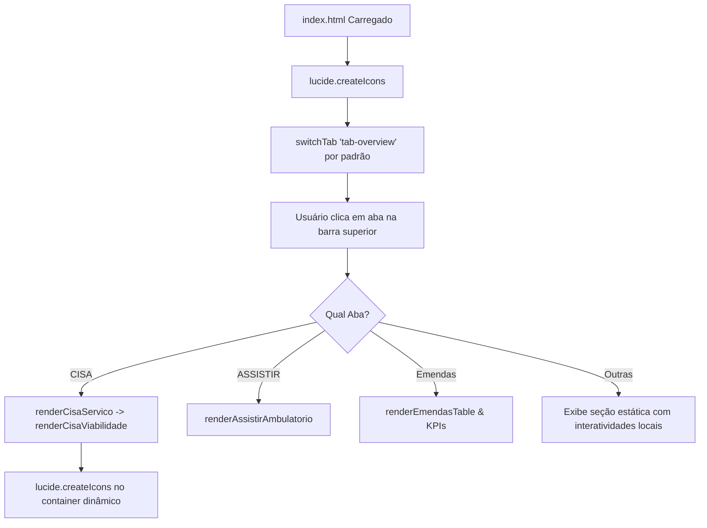

# Arquitetura Técnica & Padrões do Sistema

## 1. Stack Tecnológica
- **HTML5 Semântico**: Estrutura modular em abas (`.tab-pane`) ativadas dinamicamente sem recarregamento de página.
- **CSS3 Moderno**: Totalmente responsivo baseado em variáveis CSS no `:root` (com suporte a temas claro/escuro nativos), Grid Layout e Flexbox.
- **JavaScript Vanilla (ES6+)**: Sem frameworks pesados externos, garantindo carregamento instantâneo, compatibilidade total com navegadores e independência de build tools.
- **Lucide Icons**: Biblioteca de ícones vetoriais SVG (`data-lucide="..."`), inicializada dinamicamente com `lucide.createIcons()`.

---

## 2. Padrões de Projeto & Design System

### 2.1 Padrão Visual de Tabelas Financeiras (Padrão CISA)
Definido como padrão oficial do sistema para todas as tabelas orçamentárias:
- **Colunas Padronizadas**:
  1. Identificação / Nome do Item ou Procedimento
  2. **QTD** (Quantidade pactuada ou recursos alocados)
  3. **R$ UNITÁRIO** (Valor unitário de referência ou salário contratado)
  4. **TOTAL/MÊS** (Resultado da multiplicação `Qtd × Unitário`, com destaque visual em azul para receitas e vermelho para custos)
  5. Status / Ações (Indicadores de cotação e botões de ação compactos)
- **Cabeçalhos de Tabela**: Fundo suave, tipografia em caixa alta, tracking legível, bordas sutis.
- **Linhas e Células**: Padding vertical confortável (`8px`), inputs inline formatados e sem poluição visual.

### 2.2 Gerenciamento de Estado (State Management)
O sistema mantém seu estado em memória através de variáveis globais e objetos no escopo `window`:
- `window.cisaSimState`: Estado padrão de referência para a pactuação CISA (procedimentos e custos operacionais fixos).
- `window.activeCisaSim`: Estado ativo mutável da simulação CISA atual.
- `window.cisaProcedimentosDescricoes`: Catálogo oficial com os 15 procedimentos oftalmológicos do contrato CISA, códigos SUS SIGTAP, ícones, descrições clínicas detalhadas e finalidades diagnósticas.
- `window.AMBULATORIOS_ASSISTIR`: Dicionário completo das especialidades ambulatoriais da Portaria ASSISTIR (Cardiologia, Traumatologia, Neurologia, etc.) com metas de consultas, cirurgias e requisitos.
- `window.currentAssistirKey`: Chave do ambulatório selecionado atualmente no menu lateral do ASSISTIR.
- `window.currentCisaKey`: Chave do serviço selecionado no menu CISA (atualmente `oftalmologia`).

---

## 3. Ciclo de Vida da Aplicação e Renderização de Abas

### 3.1 Função Central de Troca de Abas (`switchTab`)
Localizada em `app.js`:
1. Remove a classe `.active` de todos os botões da barra superior e das seções `.tab-pane`.
2. Adiciona a classe `.active` ao botão selecionado e à seção alvo.
3. Rola o viewport suavemente para o topo.
4. Aciona as rotinas de renderização específicas da aba ativa.
5. Reexecuta `lucide.createIcons()` para garantir a renderização de quaisquer novos ícones injetados.

---

## 4. Motor de Cálculo CISA (Viabilidade Financeira)

### 4.1 Receita Contratada
- Cada linha com valor unitário cotado calcula:
  $$\text{Total Mensal} = \text{Qtd} \times \text{Valor Unitário Cotado}$$
- A soma compõe o indicador **Receita Mensal Contratada**.

### 4.2 Custos Operacionais Fixos
- Composto pela equipe médica especializada com RQE, corpo de enfermagem, apoio administrativo e calibração/manutenção:
  $$\text{Custo Fixo Total} = \sum (\text{Qtd} \times \text{Custo Unitário})$$

### 4.3 Modelos de Viabilidade e Rateio
1. **50% Margem Hospitalar**:
   - Equipe médica executora recebe 50% da tabela.
   - Hospital retém 50% para custeio estrutural e insumos.
2. **Rateio 80% / 20%**:
   - Equipe médica executora recebe 80% da tabela.
   - Hospital retém 20% para despesas administrativas e operacionais.
